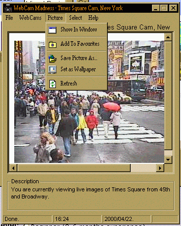



## WebCam Madness \- A must see\!  \- Source Included\.

### Description

NOW With SOURCE! (Last time I haven't included it) .I have recently submitted a code, which downloaded a picture from a webcam. With this code, you can add your own links to webcams and other often-changing pictures to the programs database and view it simply selecting from the menu. This program also implements a favourites list what has it's own menu. Just look at the picture and download it. Oh, and please don't forget to vote for it and send feedback. Thanks.
 
### More Info
 

             |
---                |---
**Submitted On**   |2000-04-19 18:50:20
**By**             |[bbence](https://github.com/Planet-Source-Code/PSCIndex/blob/master/ByAuthor/bbence.md)
**Level**          |Intermediate
**User Rating**    |3.8 (19 globes from 5 users)
**Compatibility**  |VB 5\.0, VB 6\.0
**Category**       |[Miscellaneous](https://github.com/Planet-Source-Code/PSCIndex/blob/master/ByCategory/miscellaneous__1-1.md)
**World**          |[Visual Basic](https://github.com/Planet-Source-Code/PSCIndex/blob/master/ByWorld/visual-basic.md)
**Archive File**   |[CODE\_UPLOAD51054232000\.zip](https://github.com/Planet-Source-Code/bbence-webcam-madness-a-must-see-source-included__1-7511/archive/master.zip)

